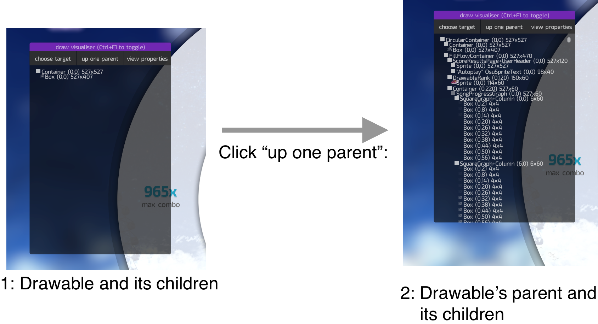
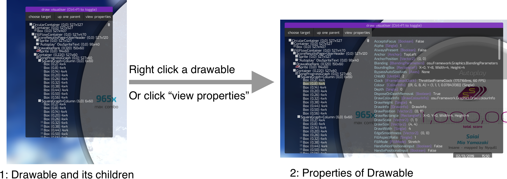

# Draw Visualiser

osu! framework provides in-picture debugging overlays, defined in `osu.Framework.Input.FrameworkActionContainer`. One such overlay is the Draw Visualizer.

## Selecting a drawable to inspect

**Ctrl-F1** toggles an overlay that allows you to access the drawable hierarchy. Selecting an object on screen will grab the instance of the drawable and display relevant information.

    

## Traversing the scene graph

    

Greyed out items in this list mean that there are additional children that are hidden from this list that you can expand by clicking on them. New transformations applied on a drawable will be represented in the form of yellow flashes appearing to the next of their respective items on the list.

While now we are able to see a lot of the drawables in this list, it does prove to be a rather large amount of clutter. To clear all items on the list except for a specific container and its children, simply double click on it.

## View Properties

All properties for each container can be accessed using the "view properties" button, or right clicking the drawable you want to access.

